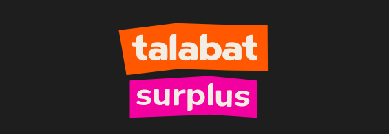
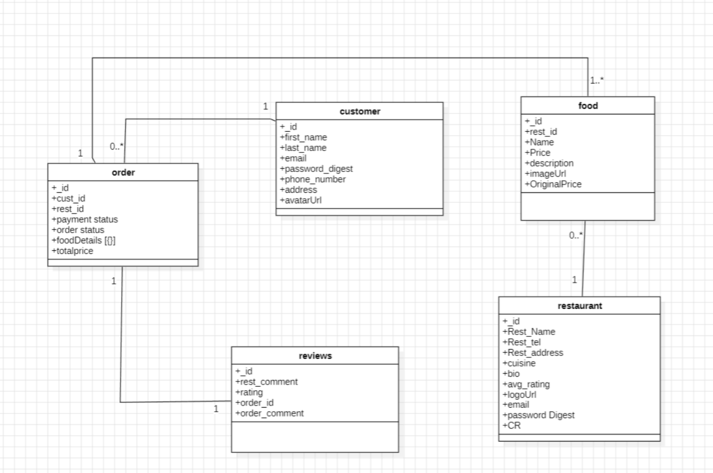
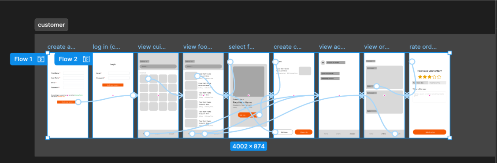
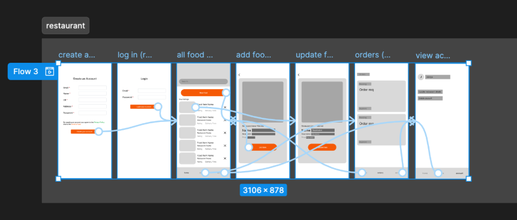
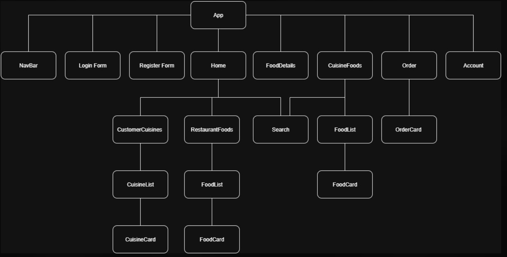

# Talabat Surplus

**By:**  
[Maryam Ali](https://github.com/maryamalihasanebrahim) | [Hussain Ahmed](https://github.com/hussainmohd03) | [Malak Jasim](https://github.com/Malak1805)

**Date:** August/14/2025
## **_Description_**
Talabat Surplus inspired by Talabat App, A mobile application created to effectively reduce food waste and combat hunger in local communities.​ Enabling food businesses to list and offer surplus food items for donation or sale.​ Assisting individuals and families to find available food donations nearby.

[Talabat-Surplus-BackEnd](https://github.com/hussainmohd03/Food-Waste-BackEnd) | [Trello](https://trello.com/b/5eItxzph/talabat-surplus)

## **_Technologies Used_**

- Programmed using VS Code v1.101.2

  - React
  - Axios
  - Express
  - Node.js
  - CSS
  - JavaScript

## **_Entity Relationship Diagram (ERD)_**

## **_Wireframes_**

**Customer**

**Restaurant**

## **_The Components Hierarchy_**

## **_Credits_**
[Figma](https://www.figma.com/design/BG7VqBopFifgfwIr99q0hQ/project_03?node-id=0-1&p=f&t=I2d6c75mhXNR0RVo-0) |
[Trello](https://trello.com/b/5eItxzph/talabat-surplus) |
[Google Docs](https://docs.google.com/presentation/d/1pLrf2j_sdU_BHdfT3VfQtgt9q0yKouFnHUSz0ZocUwE/edit?slide=id.g37348aa6e69_0_52#slide=id.g37348aa6e69_0_52) |
[StarUML]() 